# Monster Munchkins — Project Documentation

## Overview

**Monster Munchkins** is a Java-based, tile-oriented adventure game featuring RPG elements, real-time global chat, and persistent user progress. The game is built with JavaFX for UI and leverages a MySQL database for user and world data. Players can explore, battle monsters, interact with NPCs, collect items, all within a rich, asset-driven environment.

> **This game was developed for an Advanced Object Oriented Programming laboratory course. Our team became the champion among 60+ teams in that trimester!**

---

## Table of Contents

1. [Overview](#overview)
2. [Game Story](#game-story)
3. [Project Structure](#project-structure)
4. [Main Game Flow](#main-game-flow)
5. [Game States & Navigation](#game-states--navigation)
6. [Entities, Objects, and Inventory](#entities-objects-and-inventory)
7. [User Management & Database](#user-management--database)
8. [Global Chat System](#global-chat-system)
9. [UI & Assets](#ui--assets)
10. [Build & Run Instructions](#build--run-instructions)
11. [Database Schema & Setup](#database-schema--setup)
12. [Screenshots](#screenshots)
13. [Gameplay Video](#gameplay-video)
14. [Credits & Resources](#credits--resources)

---

## Game Story

The village got attacked by monsters, so villagers called upon a hunter to kill the monsters and set the island free so that the people can live peacefully. In the game, the hunter must hunt different types of monsters. There is one kind, the slime, which does not die forever—when the hunter kills them, they rise again. There is a Mother Slime, which is huge and lives on a faraway island. The hunter must kill the Mother Slime to destroy all slimes forever.

There is also treasure to be found. Trees and rocks block the hunter's path, and the hunter must cut trees and break rocks using tools. The hunter also needs to find keys to unlock different things. There is a medical shop to heal the hunter and a shop to buy tools and potions to grow abilities.

There is a Devil Island area where deadly monsters roam, and by killing all of them, the game will be over. The hunter can communicate with other hunters to overcome the difficulties he or she faces.

---

## Project Structure

- **src/main/java/com/example/return_3/**
  - `main/` — Core game loop, state management, event/collision handling
  - `Controllers/` — JavaFX controllers for UI, menus, login, and navigation
  - `entity/`, `object/`, `npc/`, `monster/` — Game world entities, items, NPCs, and monsters
  - `db/` — Database access, user management, persistence
  - `globalChat/` — Real-time chat client/server
  - `ui/` — In-game UI rendering
- **src/main/resources/**
  - FXML, images, sounds, maps, and other assets
- **lib/**
  - MySQL JDBC driver
- **pom.xml**
  - Maven build configuration

---

## Main Game Flow

- **Entry Point:** `MainGame.java` → `Game.java` (JavaFX Application)
- **Game Loop:**
  - Managed by `GameAnimationTimer`, which calls `update()` (logic) and `render()` (drawing) at 60 FPS.
  - Player input is handled by `KeyHandler`, mapping keys to actions and state changes.
- **World:**
  - Tile-based map with entities (player, NPCs, monsters, objects) managed in arrays.
  - Collision and event handling via `CollisionChecker` and `EventHandler`.
- **Scene Management:**
  - Multiple scenes (main game, login, menu) managed in `Game.java` and controllers.

---

## Game States & Navigation

- **States:** Menu, Play, Pause, Dialogue, Game Over, Global Chat, etc.
- **Navigation:**
  - Scene transitions via controllers and state changes.

---

## Entities, Objects, and Inventory

- **Entities:** Player, NPCs, monsters, interactive tiles, and objects (items, keys, potions, etc.).
- **Inventory:** Managed via a map of item codes to `Entity` objects; supports add/remove and persistence.
- **Persistence:** Objects and monsters are stored in a MySQL database and loaded per user.

---

## User Management & Database

- **Login/Registration:**
  - Handled via `MyJDBC.java` and `User.java`.
  - User data (position, stats, inventory, progress) stored in MySQL.
- **Persistence:**
  - Inventory, objects, and monsters are persisted and updated in the database.
  - User progress is saved on exit and loaded on login.

---

## Global Chat System

- **Client/Server Model:**
  - `globalChat/Server.java` — relays messages to all connected clients.
  - `globalChat/Client.java` — connects to server, sends/receives messages, updates in-game chat UI.
- **Integration:**
  - Chat can be accessed from the main game and is managed as a separate state/scene.

---

## UI & Assets

- **UI:**
  - JavaFX for all UI, with FXML files for menus, dialogs, and screens.
  - In-game UI rendering via `ui/` package.
- **Assets:**
  - Images, sounds, maps, and fonts in `resources/`.
  - Extensive use of custom graphics and audio for immersive experience.

---

## Build & Run Instructions

1. **Requirements:**
   - Java 11+
   - Maven
   - MySQL database (see `MyJDBC.java` for connection details)
2. **Setup:**
   - Place the MySQL JDBC driver in the `lib/` directory.
   - Configure your database as per the schema expected in the code.
3. **Build:**
   - Run `mvn clean install` in the project root.
4. **Run:**
   - Use `mvn javafx:run` or run the `MainGame` class from your IDE.
   - Ensure the database server is running and accessible.
5. **Chat Server:**
   - Start the chat server (`globalChat/Server.java`) separately if you want to enable global chat.

---

## Database Schema & Setup

To run Monster Munchkins, you need a MySQL database with the following tables. Use the SQL code below to create the required schema.

### 1. Create the Database

```sql
CREATE DATABASE game;
USE game;
```

### 2. Create the Tables

```sql
-- USERS TABLE
CREATE TABLE `Users` (
    `user_id` INT AUTO_INCREMENT PRIMARY KEY,
    `username` VARCHAR(50) NOT NULL UNIQUE,
    `password` VARCHAR(100) NOT NULL,
    `coin` INT DEFAULT 0,
    `energy` INT DEFAULT 100,
    `maxEnergy` INT DEFAULT 100,
    `life` INT DEFAULT 3,
    `maxLife` INT DEFAULT 3,
    `exp` INT DEFAULT 0,
    `nextLevelExp` INT DEFAULT 100,
    `level` INT DEFAULT 1,
    `strength` INT DEFAULT 1,
    `dexterity` INT DEFAULT 1,
    `bullet` INT DEFAULT 0,
    `maxBullet` INT DEFAULT 0,
    `world_x` INT DEFAULT 0,
    `world_y` INT DEFAULT 0,
    `is_ship_started` BOOLEAN DEFAULT FALSE,
    `npc_fireball` BOOLEAN DEFAULT FALSE,
    `npc_global_chat` BOOLEAN DEFAULT FALSE,
    `npc_mother_slime` BOOLEAN DEFAULT FALSE,
    `npc_welcome` BOOLEAN DEFAULT FALSE,
    `npc_axe` BOOLEAN DEFAULT FALSE,
    `game_over` BOOLEAN DEFAULT FALSE
);

-- INVENTORY TABLE
CREATE TABLE `Inventory` (
    `user_id` INT,
    `item_code` INT,
    `item_count` INT DEFAULT 0,
    PRIMARY KEY (`user_id`, `item_code`),
    FOREIGN KEY (`user_id`) REFERENCES `Users`(`user_id`) ON DELETE CASCADE
);

-- MONSTERS TABLE
CREATE TABLE `Monsters` (
    `user_id` INT,
    `indexNum` INT,
    `monster_type` INT,
    `area_type` INT,
    `tile_col` INT,
    `tile_row` INT,
    `map_num` INT,
    `destroyed` BOOLEAN DEFAULT FALSE,
    PRIMARY KEY (`user_id`, `indexNum`, `map_num`),
    FOREIGN KEY (`user_id`) REFERENCES `Users`(`user_id`) ON DELETE CASCADE
);

-- OBJECTS TABLE
CREATE TABLE `Objects` (
    `user_id` INT,
    `object_type` INT,
    `item_code` INT,
    `tile_col` INT,
    `tile_row` INT,
    `map_num` INT,
    `destroyed` BOOLEAN DEFAULT FALSE,
    PRIMARY KEY (`user_id`, `object_type`, `item_code`, `tile_col`, `tile_row`, `map_num`),
    FOREIGN KEY (`user_id`) REFERENCES `Users`(`user_id`) ON DELETE CASCADE
);
```

### 3. Setup Instructions

1. Create the database and tables using the SQL above (in MySQL Workbench, phpMyAdmin, or command line).
2. Make sure your `MyJDBC.java` connection details match your local MySQL setup.
3. You can now run the game and register/login users.

---

## Screenshots

Here are some screenshots from Monster Munchkins:

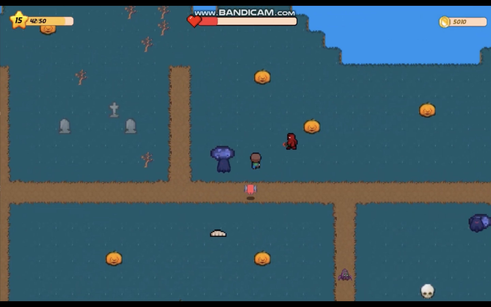
_Devil Island - Entrance_

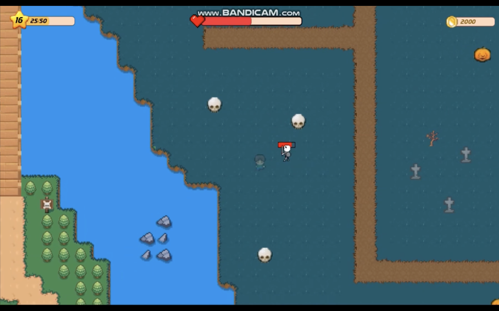
_Devil Island - Deep Area_

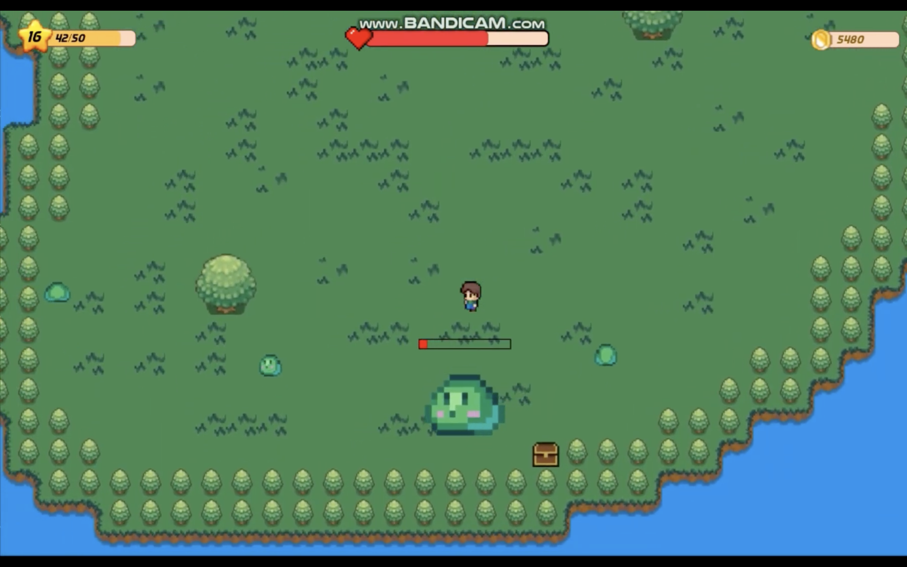
_Mother Slime Boss Battle_

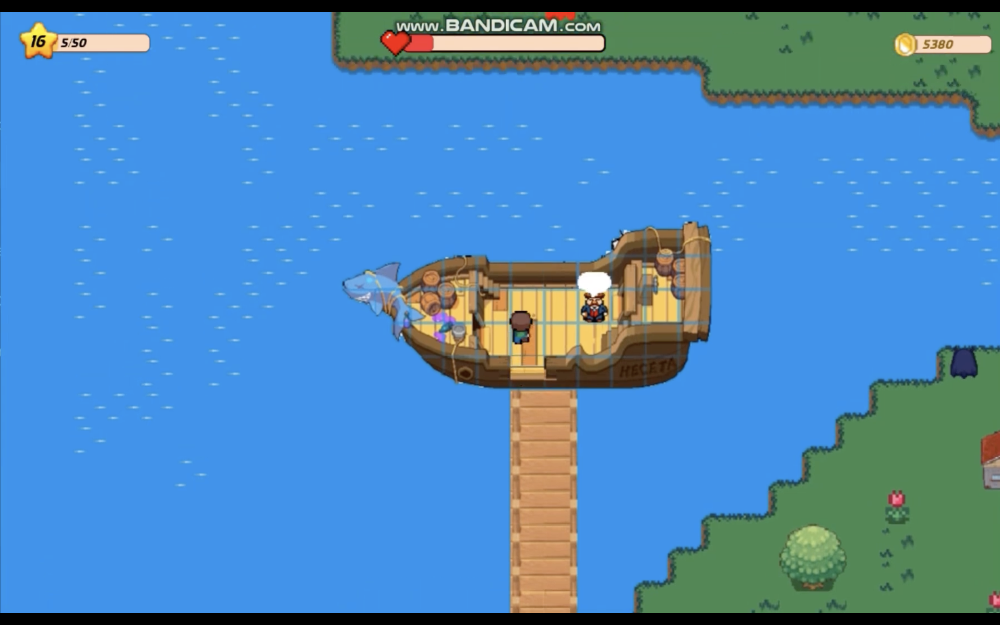
_Sailing to the Far Island_

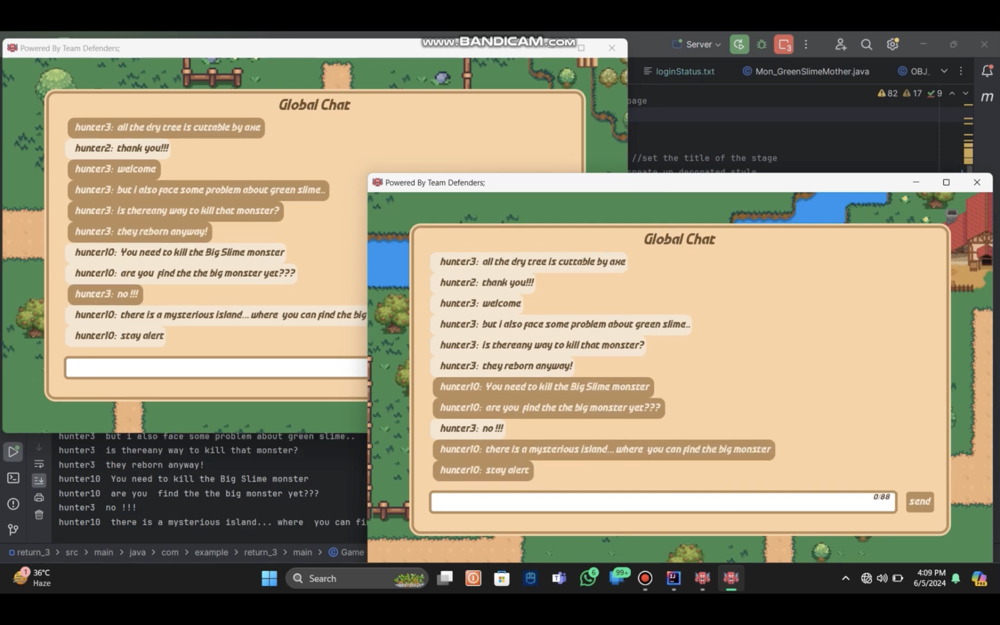
_Chatting with Other Hunters_


_Breaking Rocks to Clear Path_

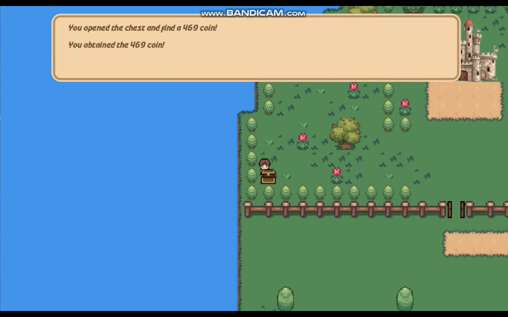
_Found a Treasure!_

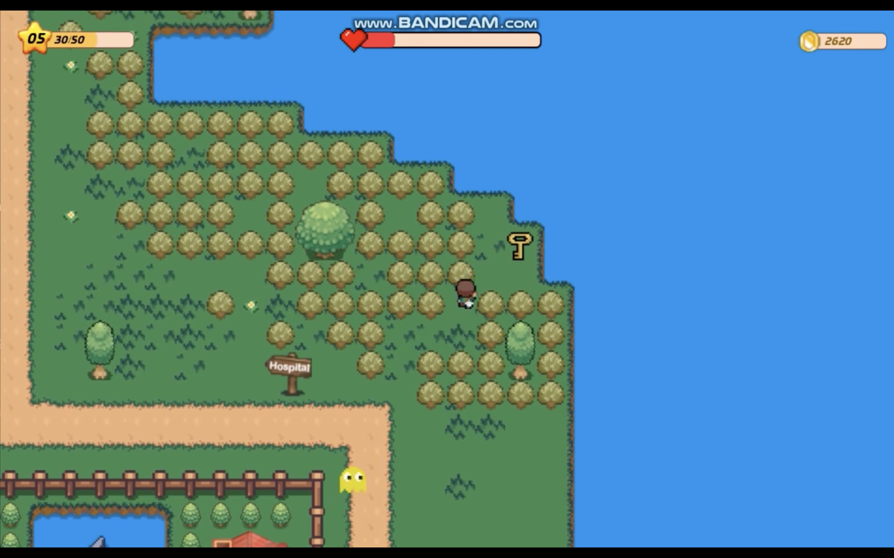
_Cutting Down Trees_

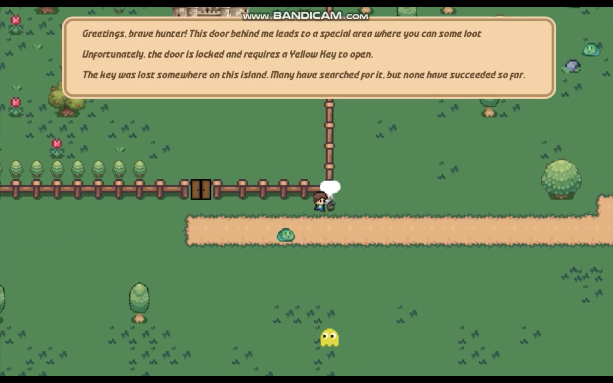
_NPC Conversation_

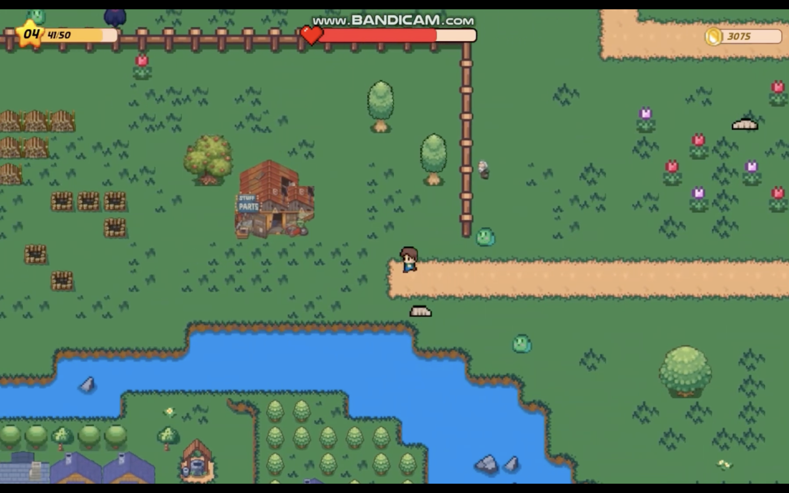
_Tool Shop_

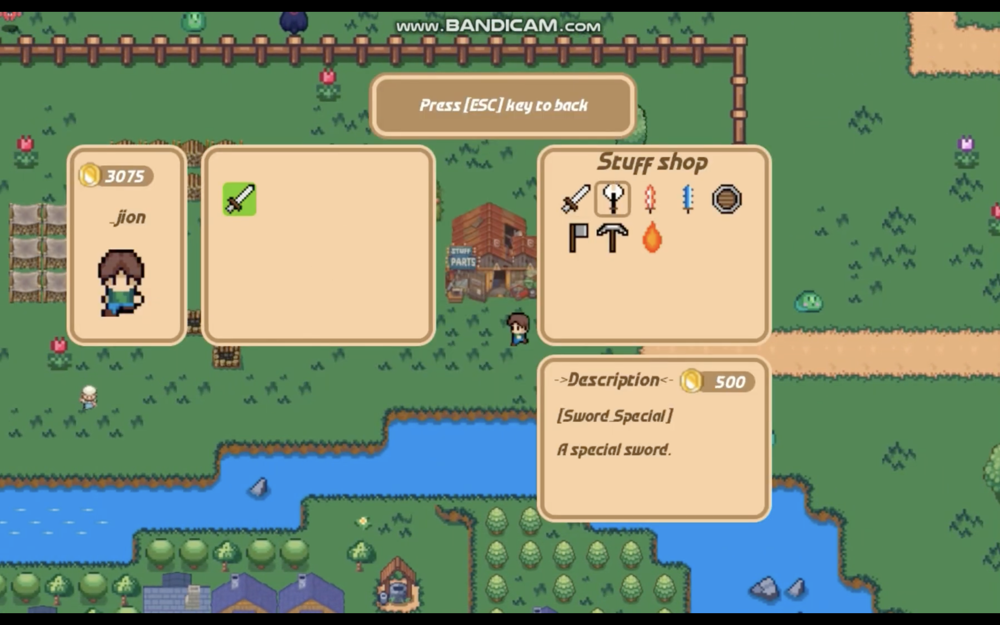
_Potion Shop_

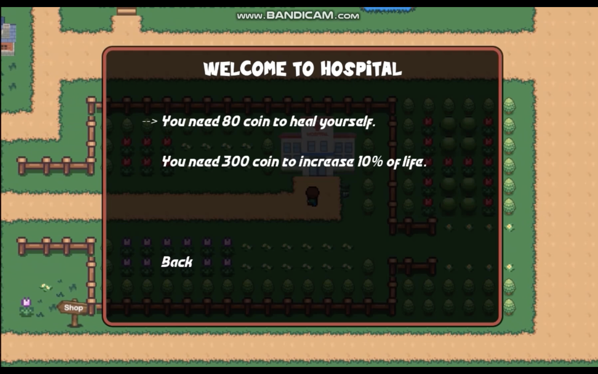
_Medical Shop_

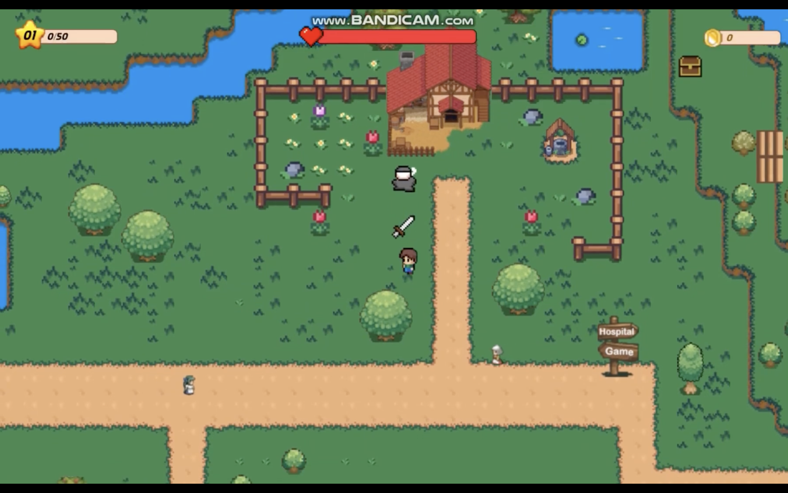
_Player's House_

---

## Gameplay Video

Watch the gameplay video on [YouTube](https://youtu.be/zc406nTytZ4?si=YOuMyCu4L_-P7Csz).

[](https://youtu.be/zc406nTytZ4?si=YOuMyCu4L_-P7Csz)

---

## Credits & Resources

- **Developed by:** Team Defenders
- **Assets:** All images, sounds, and fonts are located in the `resources/` directory.
- **Libraries:**
  - JavaFX
  - MySQL Connector/J

---

## Notes

- For detailed class and method documentation, refer to the source code and inline comments.
- The project is modular and can be extended with new entities or features.
